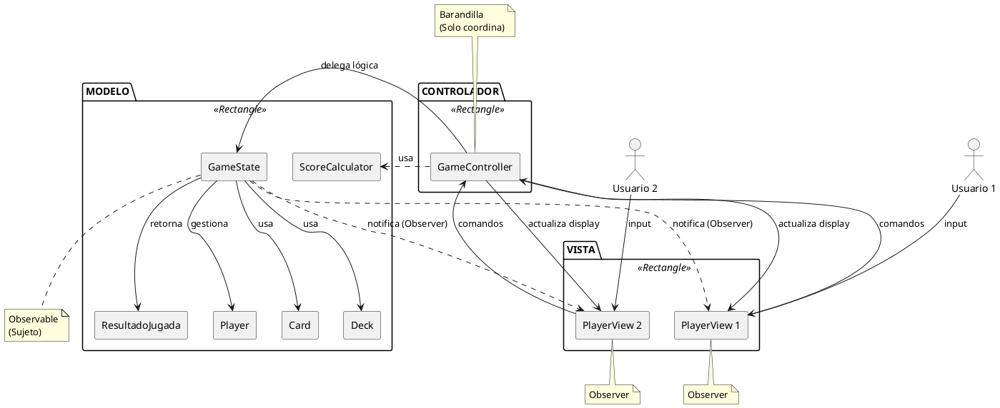
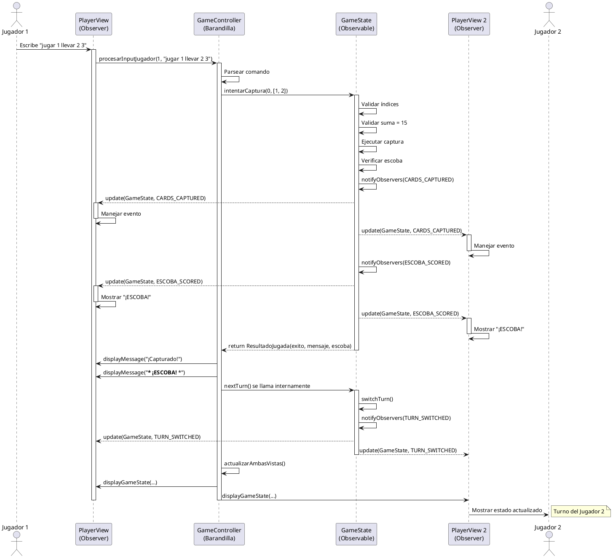
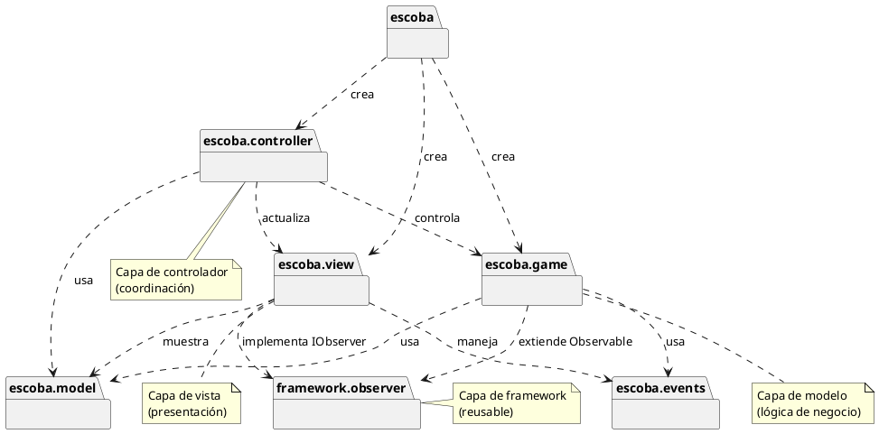

# Diagrama UML - La Escoba de 15

## Diagrama de Clases Completo (Formato PlantUML)

```plantuml
@startuml Escoba_de_15_Diagrama_Clases

skinparam classAttributeIconSize 0

' ===========================
' PAQUETE FRAMEWORK (Patrón Observer)
' ===========================

package "framework.observer" {
    interface IObservable {
        + addObserver(observer: IObserver): void
        + removeObserver(observer: IObserver): void
        + notifyObservers(event: Object): void
    }

    interface IObserver {
        + update(observable: IObservable, event: Object): void
    }

    abstract class Observable {
        - observers: List<IObserver>
        + addObserver(observer: IObserver): void
        + removeObserver(observer: IObserver): void
        + notifyObservers(event: Object): void
        # getObserverCount(): int
    }

    IObservable <|.. Observable
}

' ===========================
' PAQUETE ESCOBA - EVENTOS
' ===========================

package "escoba.events" {
    enum GameEvent {
        GAME_STARTED
        GAME_OVER
        TURN_SWITCHED
        CARDS_DEALT
        CARD_PLACED_ON_TABLE
        CARDS_CAPTURED
        ESCOBA_SCORED
        TABLE_UPDATED
    }
}

' ===========================
' PAQUETE ESCOBA - MODELO
' ===========================

package "escoba.model" {
    class Card {
        - suit: String
        - rank: String
        - gameValue: int
        + Card(suit: String, rank: String, gameValue: int)
        + getSuit(): String
        + getRank(): String
        + getGameValue(): int
        + toString(): String
    }

    class Deck {
        - cards: List<Card>
        + Deck()
        - initializeDeck(): void
        + shuffle(): void
        + draw(): Card
        + remainingCards(): int
        + isEmpty(): boolean
    }

    class Player {
        - name: String
        - hand: List<Card>
        - capturedCards: List<Card>
        - escobasCount: int
        + Player(name: String)
        + getName(): String
        + getHand(): List<Card>
        + getCapturedCards(): List<Card>
        + getEscobasCount(): int
        + addCardToHand(card: Card): void
        + removeCardFromHand(index: int): Card
        + addCapturedCard(card: Card): void
        + addCapturedCards(cards: List<Card>): void
        + incrementEscobas(): void
        + hasCardsInHand(): boolean
        + getHandSize(): int
        + getCapturedCount(): int
    }

    Deck "1" *-- "40" Card
    Player "1" o-- "*" Card
}

' ===========================
' PAQUETE ESCOBA - JUEGO (Lógica del Modelo)
' ===========================

package "escoba.game" {
    class GameState {
        - deck: Deck
        - table: List<Card>
        - player1: Player
        - player2: Player
        - currentPlayerNumber: int
        - gameOver: boolean

        + GameState()
        + startNewGame(): void
        + dealCardsToPlayers(): void
        + getCurrentPlayer(): Player
        + getOtherPlayer(): Player
        + switchTurn(): void
        + getTable(): List<Card>
        + getPlayer1(): Player
        + getPlayer2(): Player
        + getCurrentPlayerNumber(): int
        + isGameOver(): boolean
        + setGameOver(gameOver: boolean): void
        + getDeckSize(): int
        + isDeckEmpty(): boolean
        + addCardToTable(card: Card): void
        + removeCardsFromTable(cards: List<Card>): void
        + isTableEmpty(): boolean
        + jugarCarta(cardIndex: int): ResultadoJugada
        + intentarCaptura(cardIndex: int, tableIndices: List<Integer>): ResultadoJugada
        + obtenerResumenFinJuego(): String[]
        - nextTurn(): boolean
        - finishGame(): void
    }

    class ResultadoJugada {
        - exito: boolean
        - mensaje: String
        - juegoTerminado: boolean
        - esEscoba: boolean

        + ResultadoJugada(exito: boolean, mensaje: String, juegoTerminado: boolean, esEscoba: boolean)
        + isExito(): boolean
        + getMensaje(): String
        + isJuegoTerminado(): boolean
        + isEsEscoba(): boolean
        + {static} exitoSimple(mensaje: String): ResultadoJugada
        + {static} exitoConEscoba(mensaje: String): ResultadoJugada
        + {static} exitoFinJuego(mensaje: String): ResultadoJugada
        + {static} error(mensaje: String): ResultadoJugada
    }

    class ScoreCalculator {
        + {static} calculateScore(player: Player, opponent: Player): int
        + {static} getScoreBreakdown(player: Player, opponent: Player): String
        - {static} countOroCards(cards: List<Card>): int
        - {static} countSevenCards(cards: List<Card>): int
        - {static} hasSieteDeOro(cards: List<Card>): boolean
    }

    GameState "1" *-- "1" Deck
    GameState "1" o-- "2" Player
    GameState "1" o-- "*" Card
    GameState ..> ScoreCalculator
    GameState ..> ResultadoJugada
}

Observable <|-- GameState

' ===========================
' PAQUETE ESCOBA - VISTA
' ===========================

package "escoba.view" {
    class PlayerView {
        - frame: JFrame
        - textArea: JTextArea
        - inputField: JTextField
        - playerName: String
        - playerNumber: int

        + PlayerView(playerName: String, playerNumber: int, x: int, y: int)
        - createWindow(x: int, y: int): void
        + show(): void
        + setInputListener(listener: ActionListener): void
        + getInput(): String
        + clearInput(): void
        + appendText(text: String): void
        + clearText(): void
        + displayGameState(table: List<Card>, player: Player, opponent: Player, deckSize: int, isCurrentPlayer: boolean): void
        + displayMessage(message: String): void
        + displayError(error: String): void
        + displayHelp(): void
        + update(observable: IObservable, event: Object): void
    }
}

IObserver <|.. PlayerView
PlayerView ..> Card
PlayerView ..> Player

' ===========================
' PAQUETE ESCOBA - CONTROLADOR
' ===========================

package "escoba.controller" {
    class GameController {
        - gameState: GameState
        - view1: PlayerView
        - view2: PlayerView

        + GameController(gameState: GameState, view1: PlayerView, view2: PlayerView)
        + iniciarJuego(): void
        + procesarInputJugador(numeroJugador: int, input: String): void
        - manejarComandoJugar(numeroJugador: int, input: String): void
        - ejecutarColocarCarta(numeroJugador: int, indiceCarta: int): void
        - ejecutarCaptura(numeroJugador: int, indiceCarta: int, indicesMesa: List<Integer>): void
        - mostrarFinJuego(): void
        - actualizarAmbasVistas(): void
        - actualizarVista(numeroJugador: int): void
        - obtenerVista(numeroJugador: int): PlayerView
    }
}

GameController "1" --> "1" GameState
GameController "1" --> "2" PlayerView

' ===========================
' PUNTO DE ENTRADA PRINCIPAL
' ===========================

package "escoba" {
    class Main {
        + {static} main(args: String[]): void
    }
}

Main ..> GameState
Main ..> PlayerView
Main ..> GameController

' ===========================
' RELACIONES CLAVE
' ===========================

GameState ..> GameEvent

note right of Observable
    Componente del framework que
    proporciona implementación del
    patrón Observer.
    Reusable en otros proyectos.
end note

note right of GameState
    MODELO: Contiene TODA la lógica del juego
    - Validaciones
    - Reglas de negocio
    - Gestión de turnos
    - Cálculo de mensajes
    - Estado del juego
end note

note right of PlayerView
    VISTA: Solo muestra y captura input
    - Observa GameState para actualizaciones
    - No contiene lógica de negocio
end note

note right of GameController
    CONTROLADOR: Solo coordina (barandilla)
    - Parsea comandos de usuario
    - Delega TODO al Modelo
    - Muestra resultados en Vistas
    - NO contiene lógica de negocio
end note

note right of ResultadoJugada
    Encapsula resultados de operaciones
    del Modelo para que el Controller
    no tenga que construir mensajes.
end note

@enduml
```



---

## Diagrama de Arquitectura MVC Simplificado



---

## Diagrama de Secuencia del Patrón Observer



---

## Diagrama de Componentes

```plantuml
@startuml Diagrama_Componentes

package "Framework de Juego" {
    [Patrón Observer\nFramework] as Framework
}

package "Aplicación Escoba de 15" {

    component "Capa de Modelo" {
        [Gestión de\nEstado del Juego] as Modelo
        database "Datos del Juego" as Datos
    }

    component "Capa de Vista" {
        [Vista Jugador 1\n(Tema Azul)] as Vista1
        [Vista Jugador 2\n(Tema Verde)] as Vista2
    }

    component "Capa de Controlador" {
        [Controlador del Juego] as Controlador
    }

    component "Eventos" {
        [Eventos del Juego] as Eventos
    }

    component "Resultados" {
        [Resultado Jugada] as Resultado
    }
}

Framework --> Modelo : extiende Observable
Framework --> Vista1 : implementa IObserver
Framework --> Vista2 : implementa IObserver

Modelo --> Datos : gestiona
Modelo --> Eventos : produce
Modelo --> Resultado : retorna

Controlador --> Modelo : delega lógica
Controlador --> Vista1 : actualiza
Controlador --> Vista2 : actualiza

Modelo ..> Vista1 : notifica
Modelo ..> Vista2 : notifica

Vista1 --> Controlador : envía comandos
Vista2 --> Controlador : envía comandos

note right of Framework
    Patrón de diseño reusable
end note

note bottom of Modelo
    Contiene toda la lógica de negocio:
    - Gestión de cartas
    - Control de turnos
    - Reglas de validación
    - Flujo del juego
    - Generación de mensajes
end note

note bottom of Controlador
    Solo coordina:
    - NO tiene lógica
    - Solo parsea y delega
end note

@enduml
```

---

## Diagrama de Dependencias de Paquetes



---

## Cómo Generar Diagramas Visuales

### Opción 1: Editor Online de PlantUML
1. Visitar: https://www.plantuml.com/plantuml/uml/
2. Copiar el código PlantUML de arriba
3. Pegar y ver el diagrama generado
4. Exportar como PNG/SVG

### Opción 2: VS Code con Extensión PlantUML
1. Instalar extensión "PlantUML" en VS Code
2. Crear archivo `.puml` con el código de arriba
3. Usar `Alt+D` para previsualizar
4. Exportar según necesidad

### Opción 3: Línea de Comandos (requiere Graphviz)
```bash
# Instalar PlantUML y Graphviz
# Luego ejecutar:
java -jar plantuml.jar DIAGRAMA_UML.puml
```

---

## Explicación de los Diagramas

### Diagrama de Clases
- Muestra todas las clases, sus atributos, métodos y relaciones
- Demuestra herencia (Observable → GameState)
- Muestra implementación de interfaces (IObserver ← PlayerView)
- Ilustra relaciones de composición y agregación
- **IMPORTANTE**: Incluye ResultadoJugada que encapsula la lógica de mensajes

### Diagrama de Arquitectura MVC
- Vista simplificada de la implementación del patrón MVC
- Muestra flujo de datos entre componentes
- Destaca integración del patrón Observer
- Controller como "barandilla" (solo coordina)

### Diagrama de Secuencia
- Demuestra comportamiento en tiempo de ejecución
- Muestra cómo funciona el patrón Observer durante el juego
- Ilustra propagación de eventos desde Modelo a Vistas
- Muestra cómo el Controller delega al Modelo

### Diagrama de Componentes
- Vista arquitectónica de alto nivel
- Muestra componentes principales del sistema
- Demuestra separación de capas

### Diagrama de Dependencias de Paquetes
- Muestra estructura de paquetes
- Ilustra direcciones de dependencias
- Ayuda a identificar capas arquitectónicas

---

## Insights Arquitectónicos Clave

1. **Separación Limpia**: Modelo, Vista y Controlador están claramente separados
2. **Reusabilidad del Framework**: Componentes del patrón Observer en paquete separado
3. **Dependencias Unidireccionales**: Vistas dependen del Modelo, no al revés
4. **Dirigido por Eventos**: Comunicación vía eventos (enum GameEvent)
5. **Extensible**: Fácil agregar nuevas vistas o modos de juego
6. **Controller Mínimo**: El Controller es solo un coordinador sin lógica
7. **Modelo Completo**: Toda la lógica está en el Modelo, incluyendo mensajes
8. **ResultadoJugada**: Encapsula resultados para mantener Controller simple

