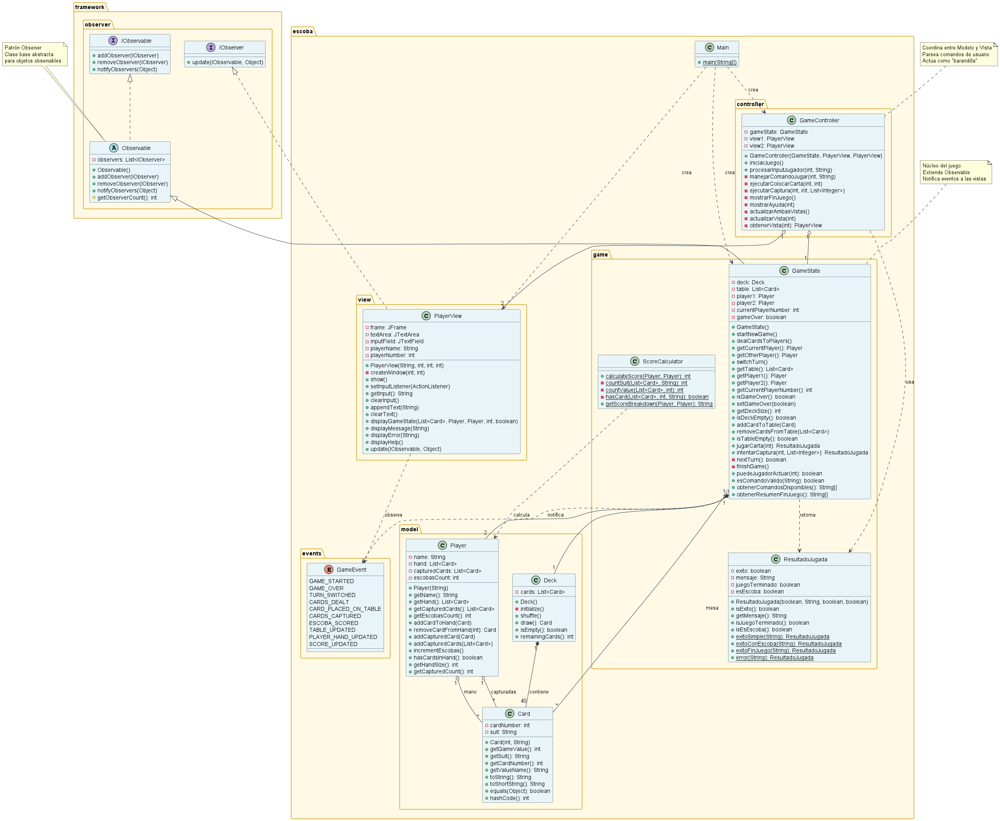

# La Escoba de 15 🎴

> Implementación del juego de cartas tradicional español en Java con arquitectura MVC y patrón Observer.

## Sobre el Juego

**La Escoba de 15** es un juego de cartas tradicional español para 2 jugadores donde el objetivo es capturar cartas de la mesa que sumen exactamente 15 puntos usando las cartas de tu mano.

### Reglas del Juego

- **Objetivo**: Capturar cartas de la mesa que sumen exactamente 15 con tus cartas
- **Valores de Cartas**:
  - Cartas 1-7: Valor nominal
  - Sota: 8 puntos
  - Caballo: 9 puntos
  - Rey: 10 puntos
- **Escoba**: ¡Limpiar todas las cartas de la mesa otorga puntos bonus!

### Sistema de Puntuación

Al final del juego, se otorgan puntos por:
-  **1 punto** por cada Escoba (limpiar la mesa)
-  **1 punto** por más cartas capturadas
-  **1 punto** por más cartas de "Oro"
-  **1 punto** por tener el 7 de Oro
-  **1 punto** por más 7s capturados

---

### Patrones de Diseño
-  **MVC (Modelo-Vista-Controlador)**: Separación limpia de responsabilidades
-  **Patrón Observer**: Sincronización de vistas en tiempo real
-  **Result Object**: Encapsulación de resultados

### Aspectos Destacados de Arquitectura
```
┌─────────────┐         ┌──────────────┐         ┌─────────────┐
│    Vista    │ ◄─────► │  Controller  │ ◄─────► │   Modelo    │
│(PlayerView) │         │(GameController)│        │(GameState)  │
└─────────────┘         └──────────────┘         └─────────────┘
      │                                                  │
      │              Patrón Observer                     │
      └────────────(Sincronización automática)──────────┘
```

### Componentes Clave

| Capa | Componente | Responsabilidad |
|------|-----------|----------------|
| **Modelo** | `GameState` | Lógica del juego, reglas, gestión de estado, mensajes |
| **Vista** | `PlayerView` | Visualización UI, captura de input del usuario |
| **Controlador** | `GameController` | Parseo de input, coordinación (barandilla) |
| **Framework** | `Observable` | Patrón Observer reutilizable |

### Diagrama UML del Sistema

<div align="center">



*Diagrama de clases completo mostrando la arquitectura MVC y el patrón Observer*

</div>

**Ver detalles completos**: [UML_Diagram.md](UML_Diagram.md)

---

##  Comenzar

### Prerequisitos
- Java JDK 8 o superior
- Línea de comandos o IDE de Java

### Compilación
```bash
cd EscobaDe15POO
javac -d out src/framework/observer/*.java src/escoba/**/*.java
```

### Ejecutar el Juego
```bash
java -cp out escoba.Main
```

---

##  Cómo Jugar

### Comandos del Juego

| Comando | Descripción | Ejemplo |
|---------|-------------|---------|
| `jugar <carta#>` | Colocar carta en la mesa | `jugar 1` |
| `jugar <carta#> llevar <mesa#> ...` | Capturar cartas (deben sumar 15) | `jugar 2 llevar 1 3` |
| `ayuda` o `help` | Mostrar ayuda en el juego | `ayuda` |
| `salir` o `quit` | Salir del juego | `salir` |

### Ejemplo de Jugada

```
CARTAS EN LA MESA:
  [1] 7 de Oro (valor: 7)
  [2] 5 de Espada (valor: 5)
  [3] 3 de Copa (valor: 3)

TU MANO:
  [1] As de Basto (valor: 1)
  [2] Sota de Oro (valor: 8)
  [3] Rey de Copa (valor: 10)

>>> jugar 2 llevar 1
Resultado: Sota(8) + 7 de Oro(7) = 15 ✓ ¡Capturado!

>>> jugar 1 llevar 2 3
Resultado: As(1) + 5 de Espada(5) + 3 de Copa(3) = 9 ✗ ¡No suma 15!
```

---

##  Estructura del Proyecto

```
EscobaDe15POO/
├── src/
│   ├── framework/
│   │   └── observer/          # Framework patrón Observer reutilizable
│   │       ├── IObservable.java
│   │       ├── IObserver.java
│   │       └── Observable.java
│   │
│   └── escoba/                # Juego Escoba de 15
│       ├── Main.java          # Punto de entrada
│       ├── controller/        # Controlador MVC (barandilla)
│       │   └── GameController.java
│       ├── model/             # Modelos de datos
│       │   ├── Card.java
│       │   ├── Deck.java
│       │   └── Player.java
│       ├── game/              # Lógica del juego (Modelo)
│       │   ├── GameState.java
│       │   ├── ResultadoJugada.java
│       │   └── ScoreCalculator.java
│       ├── view/              # Vista MVC
│       │   └── PlayerView.java
│       └── events/            # Tipos de eventos
│           └── GameEvent.java
│
├── DOCUMENTACION_PROYECTO.md  # Documentación técnica completa
├── DIAGRAMA_UML.md           # Diagramas de arquitectura
├── RESUMEN_REFACTORIZACION.md # Detalles de refactorización
└── README.md                  # Este archivo
```

---

##  Características

### Experiencia de Usuario
-  **Vistas codificadas por colores**: Jugador 1 (Azul Suave), Jugador 2 (Verde Suave)
-  **Sincronización en tiempo real**: Ambos jugadores ven actualizaciones instantáneamente
-  **Ayuda completa**: Instrucciones en el juego en español
-  **Mensajes de error claros**: Feedback útil de validación
-  **Comandos bilingües**: Soporte de español e inglés

### Características Técnicas
-  **Arquitectura MVC limpia**: Separación apropiada de responsabilidades
-  **Patrón Observer**: Actualizaciones automáticas de vistas
-  **Framework reutilizable**: Componentes Observer funcionan en cualquier proyecto
-  **Bien documentado**: Comentarios JavaDoc completos
-  **Principios SOLID**: Organización de código profesional
-  **Diseño extensible**: Fácil agregar características
-  **Controller como barandilla**: Sin lógica de negocio en el Controller

---

##  Documentación

Documentación completa disponible:

| Documento | Descripción |
|-----------|-------------|
| [**DOCUMENTACION_PROYECTO.md**](DOCUMENTACION_PROYECTO.md) | Documentación técnica completa, arquitectura, y cómo funciona el código |
| [**DIAGRAMA_UML.md**](DIAGRAMA_UML.md) | Todos los diagramas UML (clases, secuencia, componentes, etc.) |

---

##  Personalización

### Cambiar Colores
Editar `PlayerView.java` líneas 88-96:
```java
if (playerNumber == 1) {
    backgroundColor = new Color(15, 25, 45);      // Tu color
    foregroundColor = new Color(173, 216, 230);   // Tu color
}
```

### Cambiar Valores de Cartas
Editar constructor de `Card.java`:
```java
this.gameValue = gameValue;  // Modificar según necesidad
```

### Agregar Comandos
Editar método `procesarInputJugador()` en `GameController.java`:
```java
if (input.equals("tuComando")) {
    // Manejar tu comando
}
```

---

##  Extensibilidad

Esta arquitectura hace fácil agregar:

### Extensiones Fáciles
1. **Jugador IA**: Crear `AIPlayerView` implementando `IObserver`
2. **Estadísticas**: Crear `StatsObserver` para rastrear eventos del juego
3. **Juego en Red**: Crear `NetworkPlayerView` para jugadores remotos
4. **Sistema de Replay**: Grabar eventos del juego para reproducción
5. **Efectos de Sonido**: Agregar `SoundObserver` para feedback de audio
6. **Animaciones**: Agregar efectos visuales en movimientos de cartas

### Ejemplo: Agregar Jugador IA
```java
// 1. Crear Jugador IA
public class AIPlayerView implements IObserver {
    public void update(IObservable observable, Object event) {
        // Toma de decisiones de IA basada en estado del juego
    }
}

// 2. Registrar como observador
gameState.addObserver(aiPlayer);

// ¡Listo! No se necesitan cambios al código existente.
```

---

##  Resultados de Aprendizaje

Este proyecto demuestra:

### Patrones de Diseño
- ✅ Patrón Observer (actualizaciones dirigidas por eventos)
- ✅ Patrón MVC (organización arquitectónica)
- ✅ Patrón Result Object (encapsulación de resultados)

### Principios OOP
- ✅ Herencia (clase base Observable)
- ✅ Polimorfismo (interfaces IObserver, IObservable)
- ✅ Encapsulación (campos privados, acceso controlado)
- ✅ Abstracción (separación clara de responsabilidades)

### Ingeniería de Software
- ✅ Principios SOLID
- ✅ Código Limpio
- ✅ Prácticas de Documentación
- ✅ Diseño Arquitectónico

---

##  Detalles Técnicos

```
Lenguaje: Java 8+
GUI: Swing
Arquitectura: MVC + Patrón Observer
Clases Totales: 16
Patrones de Diseño: 3
Líneas de Código: ~1,500
Documentación: Completa en Español
```

---

##  Contribuir

Este es un proyecto educativo. Siéntete libre de:
- Hacer fork y modificar
- Aprender de la arquitectura
- Usar como plantilla para otros juegos
- Extender con nuevas características

---

##  Licencia

Proyecto educativo de código abierto.

---

## 📞 Enlaces Rápidos

- **Documentación Completa**: [DOCUMENTACION_PROYECTO.md](DOCUMENTACION.md)
- **Diagramas UML**: [DIAGRAMA_UML.md](UML_Diagram.md)

---

##  Resumen de Inicio Rápido

1. **Compilar**: `javac -d out src/framework/observer/*.java src/escoba/**/*.java`
2. **Ejecutar**: `java -cp out escoba.Main`
3. **Jugar**: Usa comandos como `jugar 1 llevar 2 3`
4. **Aprender**: Lee `DOCUMENTACION_PROYECTO.md`

---

<div align="center">

**¡Disfruta jugando a La Escoba de 15!** 🎴

</div>
