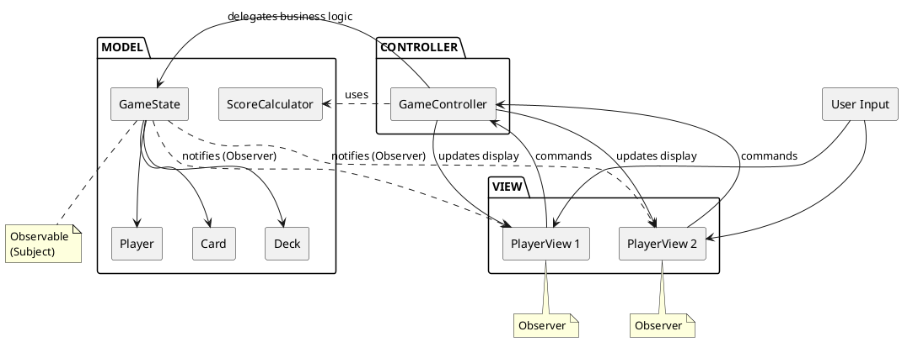
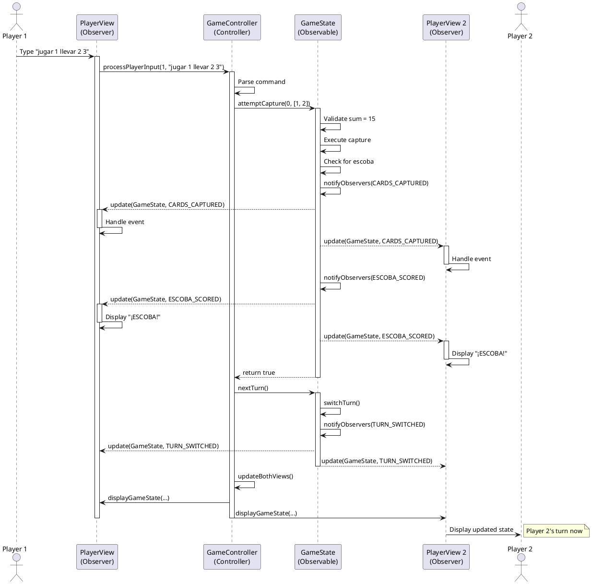
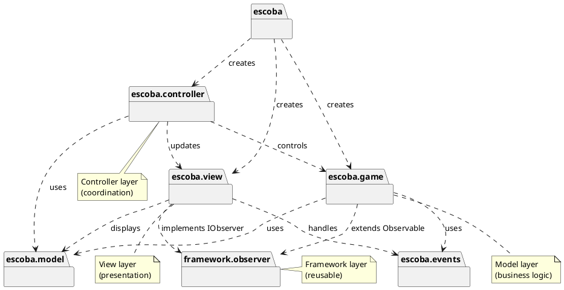

# UML Class Diagram - La Escoba de 15

## Complete Class Diagram (PlantUML Format)

```plantuml
@startuml Escoba_de_15_Class_Diagram

' ===========================
' FRAMEWORK PACKAGE (Observer Pattern)
' ===========================

package "framework.observer" {
    interface IObservable {
        +addObserver(observer: IObserver): void
        +removeObserver(observer: IObserver): void
        +notifyObservers(event: Object): void
    }

    interface IObserver {
        +update(observable: IObservable, event: Object): void
    }

    abstract class Observable {
        -observers: List<IObserver>
        +addObserver(observer: IObserver): void
        +removeObserver(observer: IObserver): void
        +notifyObservers(event: Object): void
        #getObserverCount(): int
    }

    IObservable <|.. Observable
}

' ===========================
' ESCOBA PACKAGE - EVENTS
' ===========================

package "escoba.events" {
    enum GameEvent {
        GAME_STARTED
        GAME_OVER
        TURN_SWITCHED
        CARDS_DEALT
        CARD_PLACED_ON_TABLE
        CARDS_CAPTURED
        ESCOBA_SCORED
        TABLE_UPDATED
        PLAYER_HAND_UPDATED
        SCORE_UPDATED
    }
}

' ===========================
' ESCOBA PACKAGE - MODEL
' ===========================

package "escoba.model" {
    class Card {
        -suit: String
        -rank: String
        -gameValue: int
        +Card(suit: String, rank: String, gameValue: int)
        +getSuit(): String
        +getRank(): String
        +getGameValue(): int
        +toString(): String
    }

    class Deck {
        -cards: List<Card>
        +Deck()
        -initializeDeck(): void
        +shuffle(): void
        +draw(): Card
        +remainingCards(): int
        +isEmpty(): boolean
    }

    class Player {
        -name: String
        -hand: List<Card>
        -capturedCards: List<Card>
        -escobasCount: int
        +Player(name: String)
        +getName(): String
        +getHand(): List<Card>
        +getCapturedCards(): List<Card>
        +getEscobasCount(): int
        +addCardToHand(card: Card): void
        +removeCardFromHand(index: int): Card
        +addCapturedCard(card: Card): void
        +addCapturedCards(cards: List<Card>): void
        +incrementEscobas(): void
        +hasCardsInHand(): boolean
        +getHandSize(): int
        +getCapturedCount(): int
    }

    Deck "1" *-- "40" Card : contains
    Player "1" o-- "*" Card : has in hand
    Player "1" o-- "*" Card : has captured
}

' ===========================
' ESCOBA PACKAGE - GAME (Model Logic)
' ===========================

package "escoba.game" {
    class GameState {
        -deck: Deck
        -table: List<Card>
        -player1: Player
        -player2: Player
        -currentPlayerNumber: int
        -gameOver: boolean

        +GameState()
        +startNewGame(): void
        +dealCardsToPlayers(): void
        +getCurrentPlayer(): Player
        +getOtherPlayer(): Player
        +switchTurn(): void
        +getTable(): List<Card>
        +getPlayer1(): Player
        +getPlayer2(): Player
        +getCurrentPlayerNumber(): int
        +isGameOver(): boolean
        +setGameOver(gameOver: boolean): void
        +getDeckSize(): int
        +isDeckEmpty(): boolean
        +addCardToTable(card: Card): void
        +removeCardsFromTable(cards: List<Card>): void
        +isTableEmpty(): boolean
        +playCardOnTable(cardIndex: int): boolean
        +attemptCapture(cardIndex: int, tableIndices: List<Integer>): boolean
        +nextTurn(): boolean
        +finishGame(): void
        +calculateCaptureSum(cardIndex: int, tableIndices: List<Integer>): int
    }

    class ScoreCalculator {
        {static} +calculateScore(player: Player, opponent: Player): int
        {static} +getScoreBreakdown(player: Player, opponent: Player): String
        {static} -countOroCards(cards: List<Card>): int
        {static} -countSevenCards(cards: List<Card>): int
        {static} -hasSieteDeOro(cards: List<Card>): boolean
    }

    GameState "1" *-- "1" Deck : manages
    GameState "1" o-- "2" Player : has
    GameState "1" o-- "*" Card : table cards
    GameState ..> ScoreCalculator : uses
}

Observable <|-- GameState

' ===========================
' ESCOBA PACKAGE - VIEW
' ===========================

package "escoba.view" {
    class PlayerView {
        -frame: JFrame
        -textArea: JTextArea
        -inputField: JTextField
        -playerName: String
        -playerNumber: int

        +PlayerView(playerName: String, playerNumber: int, x: int, y: int)
        -createWindow(x: int, y: int): void
        +show(): void
        +setInputListener(listener: ActionListener): void
        +getInput(): String
        +clearInput(): void
        +appendText(text: String): void
        +clearText(): void
        +displayGameState(table: List<Card>, player: Player, opponent: Player, deckSize: int, isCurrentPlayer: boolean): void
        +displayMessage(message: String): void
        +displayError(error: String): void
        +displayHelp(): void
        +update(observable: IObservable, event: Object): void
    }
}

IObserver <|.. PlayerView
PlayerView ..> Card : displays
PlayerView ..> Player : displays

' ===========================
' ESCOBA PACKAGE - CONTROLLER
' ===========================

package "escoba.controller" {
    class GameController {
        -gameState: GameState
        -view1: PlayerView
        -view2: PlayerView

        +GameController(gameState: GameState, view1: PlayerView, view2: PlayerView)
        +startGame(): void
        +processPlayerInput(playerNumber: int, input: String): void
        -handlePlayCommand(playerNumber: int, input: String): void
        -handlePlaceCard(playerNumber: int, cardIndex: int): void
        -handleCapture(playerNumber: int, cardIndex: int, tableIndices: List<Integer>): void
        -handleGameOver(): void
        -displayGameOver(view: PlayerView, p1: Player, p2: Player, score1: int, score2: int): void
        -updateBothViews(): void
        -updatePlayerView(playerNumber: int): void
        -getView(playerNumber: int): PlayerView
    }
}

GameController "1" --> "1" GameState : controls
GameController "1" --> "2" PlayerView : updates

' ===========================
' MAIN ENTRY POINT
' ===========================

package "escoba" {
    class Main {
        {static} +main(args: String[]): void
    }
}

Main ..> GameState : creates
Main ..> PlayerView : creates
Main ..> GameController : creates

' ===========================
' KEY RELATIONSHIPS
' ===========================

GameState ..> GameEvent : notifies with

note right of Observable
    Framework component providing
    Observer pattern implementation.
    Reusable across projects.
end note

note right of GameState
    Model: Contains all game logic
    - Card placement
    - Capture validation
    - Turn management
    - Game state
end note

note right of PlayerView
    View: Displays game state
    and captures user input.
    Observes GameState for updates.
end note

note right of GameController
    Controller: Coordinates between
    Model and Views. Parses input,
    delegates to Model, updates Views.
end note

@enduml
```



---

## Simplified MVC Architecture Diagram



---

## Observer Pattern Sequence Diagram



---

## Component Diagram

```plantuml
@startuml Component_Diagram

package "Game Framework" {
    [Observer Pattern\nFramework] as Framework
}

package "Escoba de 15 Application" {

    component "Model Layer" {
        [Game State\nManagement] as Model
        database "Game Data" as Data
    }

    component "View Layer" {
        [Player View 1\n(Blue Theme)] as View1
        [Player View 2\n(Green Theme)] as View2
    }

    component "Controller Layer" {
        [Game Controller] as Controller
    }

    component "Events" {
        [Game Events] as Events
    }
}

Framework --> Model : extends Observable
Framework --> View1 : implements IObserver
Framework --> View2 : implements IObserver

Model --> Data : manages
Model --> Events : produces

Controller --> Model : delegates logic
Controller --> View1 : updates
Controller --> View2 : updates

Model ..> View1 : notifies
Model ..> View2 : notifies

View1 --> Controller : sends commands
View2 --> Controller : sends commands

note right of Framework
    Reusable design pattern
    implementation
end note

note bottom of Model
    Contains all business logic:
    - Card management
    - Turn control
    - Validation rules
    - Game flow
end note

@enduml
```

---

## Package Dependency Diagram



---

## How to Generate Visual Diagrams

### Option 1: Online PlantUML Editor
1. Visit: https://www.plantuml.com/plantuml/uml/
2. Copy the PlantUML code from above
3. Paste and view the generated diagram
4. Export as PNG/SVG

### Option 2: VS Code with PlantUML Extension
1. Install "PlantUML" extension in VS Code
2. Create a `.puml` file with the code above
3. Use `Alt+D` to preview
4. Export as needed

### Option 3: Command Line (requires Graphviz)
```bash
# Install PlantUML and Graphviz
# Then run:
java -jar plantuml.jar UML_DIAGRAM.puml
```

---

## Diagram Explanations

### Class Diagram
- Shows all classes, their attributes, methods, and relationships
- Demonstrates inheritance (Observable → GameState)
- Shows interface implementation (IObserver ← PlayerView)
- Illustrates composition and aggregation relationships

### MVC Architecture Diagram
- Simplified view of the MVC pattern implementation
- Shows data flow between components
- Highlights Observer pattern integration

### Sequence Diagram
- Demonstrates runtime behavior
- Shows how Observer pattern works during gameplay
- Illustrates event propagation from Model to Views

### Component Diagram
- High-level architectural view
- Shows major system components
- Demonstrates layer separation

### Package Dependency Diagram
- Shows package structure
- Illustrates dependency directions
- Helps identify architectural layers

---

## Key Architectural Insights

1. **Clean Separation**: Model, View, and Controller are clearly separated
2. **Framework Reusability**: Observer pattern components are in separate package
3. **One-way Dependencies**: Views depend on Model, not vice versa
4. **Event-Driven**: Communication via events (GameEvent enum)
5. **Extensible**: Easy to add new views or game modes

