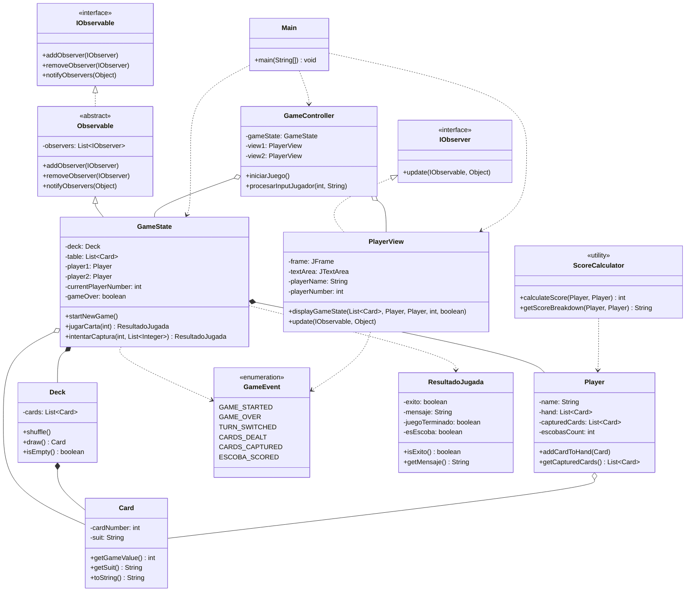

# Diagrama UML - La Escoba de 15

## Diagrama de Clases Completo


## Descripción del Diagrama

### Paquetes y Responsabilidades

#### 1. **framework.observer** (Patrón Observer)
- `IObserver` - Interfaz para objetos que observan cambios
- `IObservable` - Interfaz para objetos observables
- `Observable` - Clase abstracta base que implementa el patrón Observer

#### 2. **escoba.model** (Modelo de Datos)
- `Card` - Representa una carta española (1-7, Sota, Caballo, Rey)
- `Deck` - Mazo de 40 cartas
- `Player` - Jugador con mano, cartas capturadas y escobas

#### 3. **escoba.events** (Eventos del Juego)
- `GameEvent` - Enum con todos los eventos del juego

#### 4. **escoba.game** (Lógica del Juego)
- `GameState` - Estado del juego, extiende Observable
- `ScoreCalculator` - Calcula puntuaciones al final
- `ResultadoJugada` - Encapsula el resultado de una jugada

#### 5. **escoba.view** (Vista)
- `PlayerView` - Ventana GUI del jugador, implementa IObserver

#### 6. **escoba.controller** (Controlador)
- `GameController` - Coordina entre modelo y vistas

#### 7. **escoba** (Principal)
- `Main` - Punto de entrada de la aplicación

## Relaciones Principales

### Patrón Observer
```
GameState (Observable) --notifica--> PlayerView (Observer)
```

### Arquitectura MVC
```
PlayerView (View) <--> GameController (Controller) <--> GameState (Model)
```

### Composición
- `GameState` contiene 1 `Deck`, 2 `Player`, y múltiples `Card` en mesa
- `Deck` contiene 40 `Card`
- `Player` contiene múltiples `Card` (mano y capturadas)
- `GameController` tiene referencias a `GameState` y 2 `PlayerView`

### Dependencias
- `GameState` retorna `ResultadoJugada`
- `GameState` notifica `GameEvent`
- `ScoreCalculator` calcula puntos de `Player`
- `PlayerView` observa `GameEvent`
- `GameController` usa `ResultadoJugada`


## Diagrama Simplificado (Mermaid)


